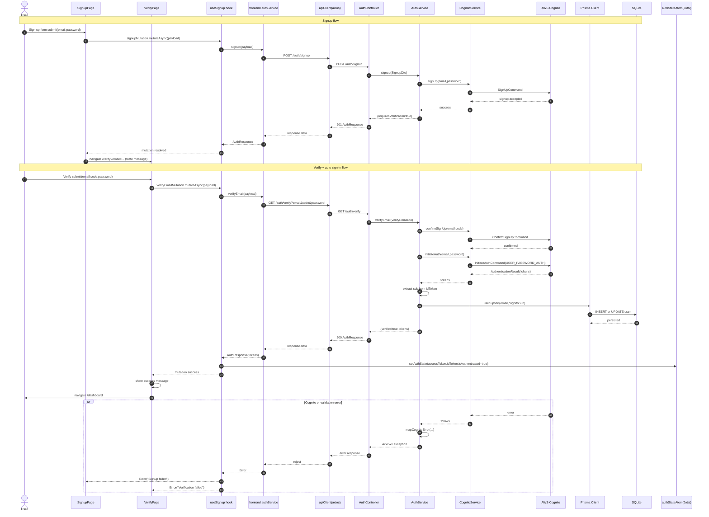

# Auth Sequence Diagram

以下は現行実装に基づく認証フロー（Signup -> Verify -> Auto Sign-in）のシーケンス図です。

```mermaid
sequenceDiagram
    autonumber
    actor U as User
    participant SP as SignupPage
    participant VP as VerifyPage
    participant HK as useSignup hook
    participant FS as frontend authService
    participant API as apiClient(axios)
    participant AC as AuthController
    participant AS as AuthService
    participant CS as CognitoService
    participant CG as AWS Cognito
    participant PR as Prisma Client
    participant DB as SQLite
    participant ST as authStateAtom(Jotai)

    Note over U,DB: Signup flow
    U->>SP: Sign up form submit(email,password)
    SP->>HK: signupMutation.mutateAsync(payload)
    HK->>FS: signup(payload)
    FS->>API: POST /auth/signup
    API->>AC: POST /auth/signup
    AC->>AS: signup(SignupDto)
    AS->>CS: signUp(email,password)
    CS->>CG: SignUpCommand
    CG-->>CS: signup accepted
    CS-->>AS: success
    AS-->>AC: {requiresVerification:true}
    AC-->>API: 201 AuthResponse
    API-->>FS: response.data
    FS-->>HK: AuthResponse
    HK-->>SP: mutation resolved
    SP->>VP: navigate /verify?email=... (state message)

    Note over U,DB: Verify + auto sign-in flow
    U->>VP: Verify submit(email,code,password)
    VP->>HK: verifyEmailMutation.mutateAsync(payload)
    HK->>FS: verifyEmail(payload)
    FS->>API: GET /auth/verify?email&code&password
    API->>AC: GET /auth/verify
    AC->>AS: verifyEmail(VerifyEmailDto)
    AS->>CS: confirmSignUp(email,code)
    CS->>CG: ConfirmSignUpCommand
    CG-->>CS: confirmed
    AS->>CS: initiateAuth(email,password)
    CS->>CG: InitiateAuthCommand(USER_PASSWORD_AUTH)
    CG-->>CS: AuthenticationResult(tokens)
    CS-->>AS: tokens
    AS->>AS: extract sub from idToken
    AS->>PR: user.upsert(email,cognitoSub)
    PR->>DB: INSERT or UPDATE user
    DB-->>PR: persisted
    AS-->>AC: {verified:true,tokens}
    AC-->>API: 200 AuthResponse
    API-->>FS: response.data
    FS-->>HK: AuthResponse(tokens)
    HK->>ST: setAuthState(accessToken,idToken,isAuthenticated=true)
    HK-->>VP: mutation success
    VP->>VP: show success message
    VP->>U: navigate /dashboard

    alt Cognito or validation error
        CG-->>CS: error
        CS-->>AS: throws
        AS->>AS: mapCognitoError(...)
        AS-->>AC: 4xx/5xx exception
        AC-->>API: error response
        API-->>FS: reject
        FS-->>HK: Error
        HK-->>SP: Error("Signup failed")
        HK-->>VP: Error("Verification failed")
    end
```
