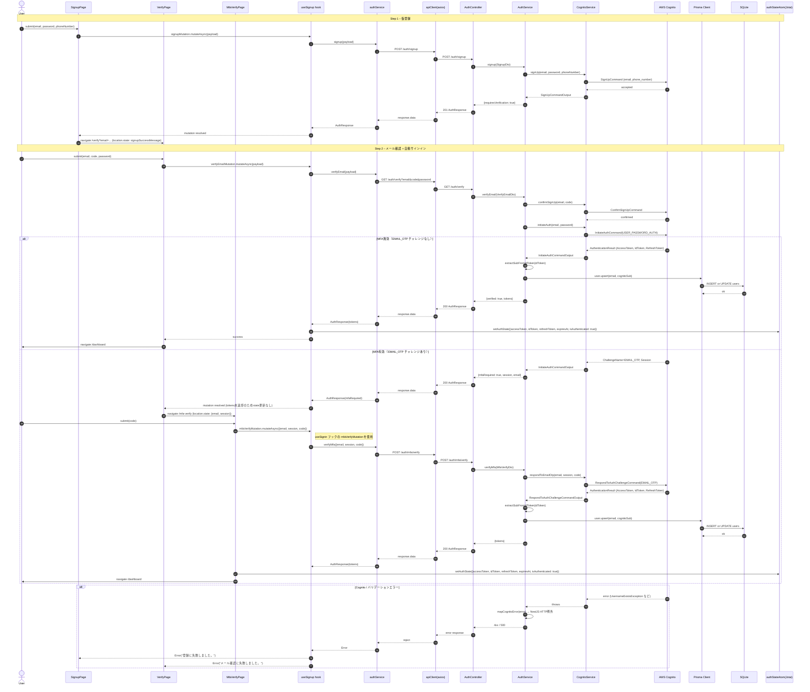
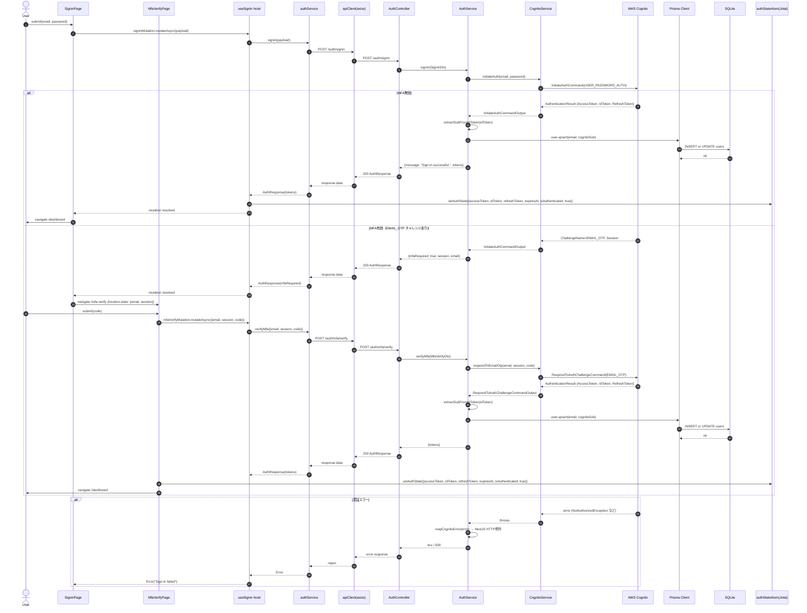
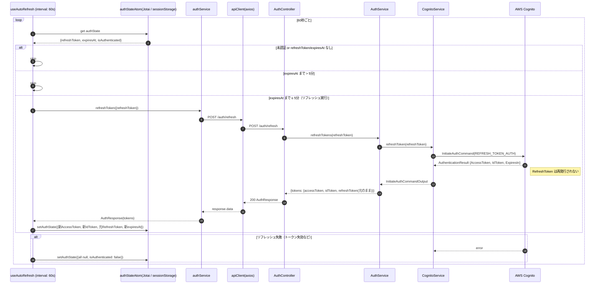

# Auth Sequence Diagram

現行実装に基づく認証フローのシーケンス図。

## Signup フロー

`/signup` → `/verify` → `/dashboard`（MFA有効時は `/mfa-verify` 経由）

---

## Signin フロー

`/signin` → `/dashboard`（MFA有効時は `/mfa-verify` 経由）

---

## トークンリフレッシュ（自動）

`useAutoRefresh` フックが `app.tsx` でグローバルにマウントされ、1分ごとに有効期限を監視する。

